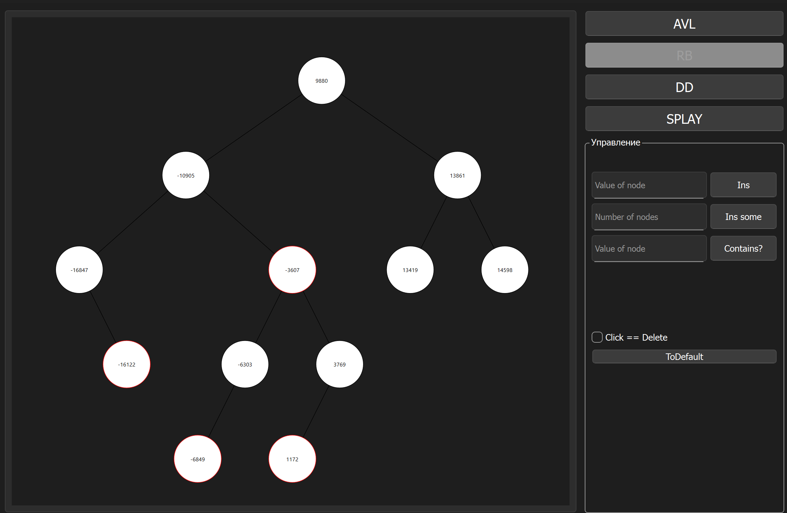
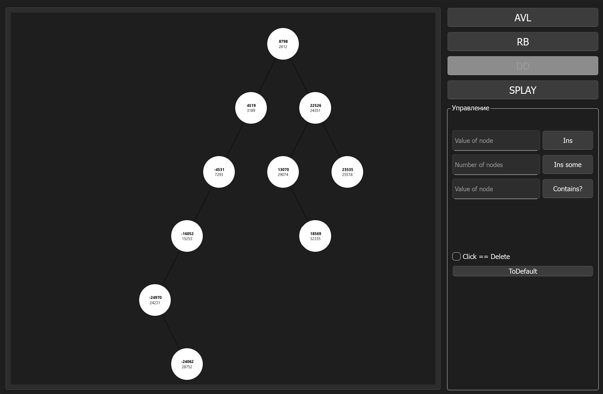

# Tree Visualizer (Qt C++)

**Tree Visualizer** is an interactive application for visualizing and experimenting with various **binary search tree structures**. Built with **Qt C++**, it allows you to dynamically create, manipulate, and explore the behavior of self-balancing trees in real time.

Supported tree types include:

- **AVL Tree**
- **Red-Black Tree**
- **Splay Tree**
- **Treap** (Cartesian Tree)

  
  

  

---

## Features

- 📥 **Insert single node** with custom numeric value
- 🎲 **Insert multiple random nodes** at once
- 🔍 **Search** for a specific value in the tree
- 🖱️ **Click-to-delete mode**: Enable a mode where clicking on a node deletes it, showing how the tree rebalances or restructures
- 🧩 **Switch between tree types**: AVL, Splay, Red-Black, Treap
- 🖼️ **Zoom in/out** using the mouse wheel
- ✋ **Drag the tree view** with mouse for better navigation

---

## Technologies Used

- **C++17**
- **Qt Framework** (Widgets, Graphics View Framework)
- Custom implementations of tree structures and visualization logic

---
